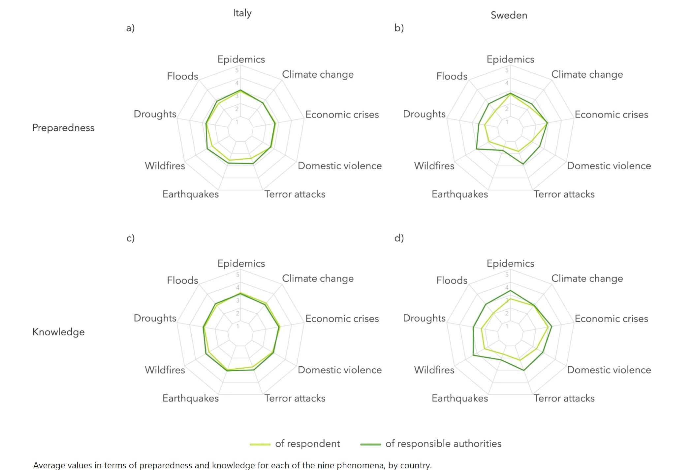

# Agenda

1. Searching for the right study
2. The original study 
3. Survey replication
4. Transforming the data
5. Coding
6. Results

# Searching for the study


# Original Study

```{r, out.width = "600px", echo = FALSE, fig.align='center'}
knitr::include_graphics("pictures_for_presentation/picture_1.jpg")
```

<br />
```{r, out.width = "600px", echo = FALSE, fig.align='center'}
knitr::include_graphics("pictures_for_presentation/picture_2.jpg")
```

<br />
```{r, out.width = "600px", echo = FALSE, fig.align='center'}
knitr::include_graphics("pictures_for_presentation/picture_3.jpg")
```

<br />
```{r, out.width = "600px", echo = FALSE, fig.align='center'}

```

# Survey replication
<br />
```{r, out.width = "600px", echo = FALSE, fig.align='center'}
knitr::include_graphics("pictures_for_presentation/survey_image_1.jpg")
```


# Extended study


# Results

# Sources

Original study: https://www.nature.com/articles/s41597-020-00778-7?fbclid=IwAR1GqAQNW6oCa3gQLC9JEpVaJBAw8SBcc7fobxNX5ybJzwzZvirVxixXVlY