```{r, echo = FALSE, results = 'hide', message = FALSE, warning = FALSE, fig.show = 'hide'}

library(dplyr)
library(DiagrammeR)
```
# Agenda

1. Searching for the right study
2. The original study 
3. Survey replication
4. Extended study
5. Original data
6. Gathered data
7. Steps to preprocess
8. Functions and good practice coding
9. Full reproducibility
10. Results

# Searching for the study

What we looked for in our target study:
<br />
1. Available data with labeled and coherent variables
<br />
2. Available survey process
<br />
3. Available codes
<br />
4. A realistic reproducible approach


# Original Study
```{r, out.width = "600px", echo = FALSE, fig.align='center'}
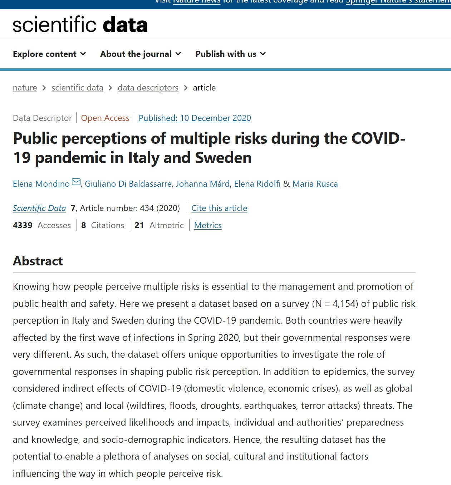
```

<br />
```{r, out.width = "600px", echo = FALSE, fig.align='center'}
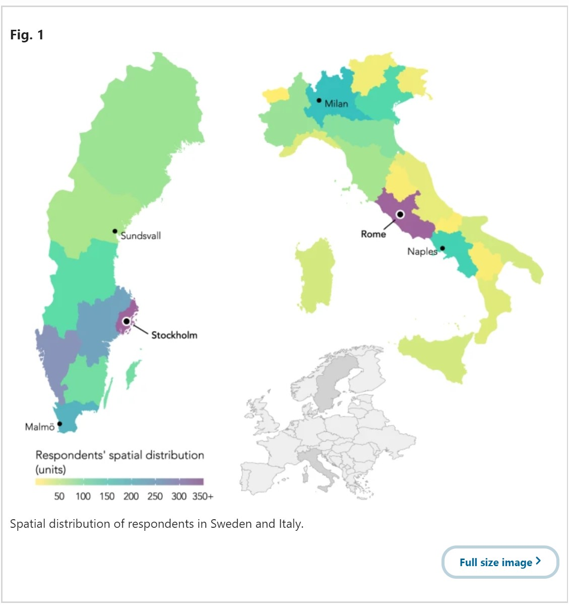
```

<br />
```{r, out.width = "600px", echo = FALSE, fig.align='center'}
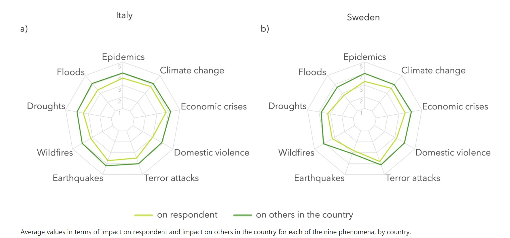
```

<br />
```{r, out.width = "600px", echo = FALSE, fig.align='center'}
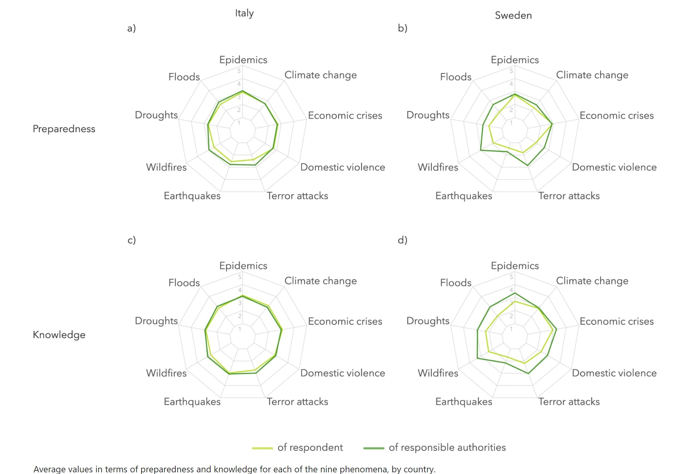
```

# Survey replication

Link to our survey: https://docs.google.com/forms/d/e/1FAIpQLSeN__k2KDdbRZIkhZ3ubUIVTXc6kPAtjSIqh1bI07bDzVrpNg/viewform?fbclid=IwAR26g8tf0azKeNHSU1FgNR1wvvhTrOis891X9dU9bBNVU1gdfoan9cZkcVE


# Extended study

We extended the study by collecting data from Polish respondents and we managed to get a little over 20 respondents to participate. As the sample we collected was rather small, there was no point in extending the study by Poland's regional analysis. Therefore we focued on the radar graphs and the perceptions of risk by country.

<br />

It is crucial to mention that the study was conducted during the onset of the pandemic in 2020. Our extension of the study was done after the vaccination period and towards the end of the pandemic. This means that our respondents could perceive risk differently now than they have two years ago. Simply put the time factor impacts our study.

# Original data

```{r, results = "asis", echo = FALSE, message = FALSE, warning = FALSE, fig.show = 'hide'}
df <- read.csv("data/Dataset_round1_august2020.csv", header = TRUE, na = "999")
df %>%
        head() %>%
        knitr::kable(format = "markdown", booktabs = T) %>%
        kableExtra::kable_styling(font_size = 7)
```

# Gathered data

```{r, echo = FALSE, message = FALSE, warning = FALSE, fig.show = 'hide'}
df_new <- read.csv("data/survey.csv", header = TRUE, na = "999")
df_new %>%
        head() %>%
        knitr::kable(format = "markdown", booktabs = T) %>%
        kableExtra::kable_paper(font_size = 7)
```

# Steps to preprocess
<center>
```{r echo = FALSE,  message = FALSE, warning = FALSE, fig.show = 'hide', fig.align='center'}
grViz("digraph {
graph [layout = dot, rankdir = TB]

node [shape = rectangle]
rec1 [label = 'Step 1. Creating mapping tibble between original column names and collected ones']
rec2 [label = 'Step 2. Splitting the data depending on scale (Likert, dichotomous, numeric']
rec3 [label =  'Step 3. For each datarame we do a conversion between original values mainly with pivoting.']
rec4 [label = 'Step 4. Joining the DataFrames into one, final one.']

# edge definitions with the node IDs
rec1 -> rec2 -> rec3 -> rec4
}",
                  height = 300)
```
</center>

# Functions and good practice coding
#### Functions {.tabset .tabset-pills}
Defining functions for data preparation and graphing

##### Specific column selection function
```{r}
#' Returns tibble with only necessary columns for aggregation.
#'
#' @param dataframe_to_derive_column_names A tibble based on which the necessary columns will be derived.
#' @param dataframe_to_modify A tibble that will be used for subsetting.
#' @param start index of the first column
#' @param end index of the last column
#' @return tibble only with columns between start and end indexes and an area column
derive_necessary_columns <- function(dataframe_to_derive_column_names, dataframe_to_modify, start, end){
  only_columns_for_chart <- dataframe_to_derive_column_names[,c(start:end, 85)] %>% names()

  final_dataframe <- dataframe_to_modify %>% select(all_of(only_columns_for_chart))
  return(final_dataframe)
}
```

##### Data aggregation function

```{r}
#' Returns tibble aggregated by the chosen variable.
#'
#' @param dataset A tibble based on which the necessary columns will be derived.
#' @param start index of the first column
#' @param end index of the last column
#' @param aggregating_variable the grouping column
#' @return aggregated tibble
aggregate_method <- function(dataset, start, end, aggregating_variable){
  return(aggregate(dataset[,start:end], by = list(aggregating_variable),
                   FUN = mean, na.rm = TRUE))
}
```


##### Specific country data preparation function
```{r}
#' Returns complete dataframe for a country, with the structure that is required by
#' by radarchart function from fmsb library.
#'
#' @param dataframe_1 First dataframe
#' @param dataframe_2 index of the first column
#' @param row_to_select index of the row to select from the final DataFrame
#' @param rowname_1 name of the first rowname
#' @param rowname_2 name of the second rowname
#' @return dataframe for the country
derive_dataframe_for_country <- function(dataframe_1, dataframe_2, row_to_select,
                                         rowname_1, rowname_2){
  colnames(dataframe_1) <- c("area", "Epidemics", "Floods", "Drought", "Wildfires", "Earthquakes",
                             "Terror attacks", "Domestic violence", "Economic crises", "Climate Change")
  colnames(dataframe_2) <- c("area", "Epidemics", "Floods", "Drought", "Wildfires", "Earthquakes",
                             "Terror attacks", "Domestic violence", "Economic crises", "Climate Change")
  df_to_return <- rbind(dataframe_1[row_to_select,], dataframe_2[row_to_select,])
  df_to_return <- df_to_return[,2:10]
  rownames(df_to_return) <- c(rowname_1, rowname_2)
  df_to_return <- rbind(rep(5,9) , rep(1,9) , df_to_return) #needed for creating radarchart successfully
  return(df_to_return)
}
```


##### Graphing function
```{r}
#' Plots the radarchart based on the provided DataFrame, with the given title,
#' The labels in the legend correspond to legend_1 and legend_2.
#'
#' @param dataframe dataframe that is required by radarchart function from fmsb library.
#' @param title title to put on the chart
#' @param legend_1 legend for the first froup
#' @param legend_2 legend for the second group
#' @return dataframe for the country
graph_radar <- function(dataframe, title, legend_1, legend_2){
  graph <- radarchart(dataframe,
                      axistype = 1 ,
                      #customize the polygons
                      pcol = colors_border,
                      #pfcol = , # for filling the polygons
                      pty = 32,
                      plwd = 2,
                      plty = 1,
                      #customize the grid
                      cglcol = "grey",
                      cglty = 1,
                      axislabcol = "grey",
                      caxislabels = seq(1,5,1),
                      cglwd = 0.8,
                      #custom labels
                      vlcex = 0.9,
                      title = title)
  legend(x = 1.5, y = 1, legend = c(legend_1, legend_2),
         bty = "n", pch = 20 , col = colors_border, text.width = 2, cex = 0.8, pt.cex = 2)
}
```


# Full reproducibility

1. Groundhog library for reproducible environment
2. GitHub for working on code (we created issue and PR, as well as merge to master branch)
3. Google Drive for storing data (we know that storing data on public repository is not a good practice)


# Results

## Damage
```{r, out.width = "500px", echo = FALSE}
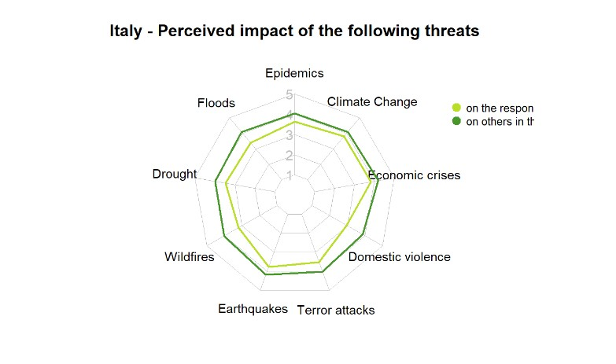
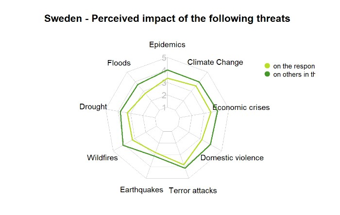
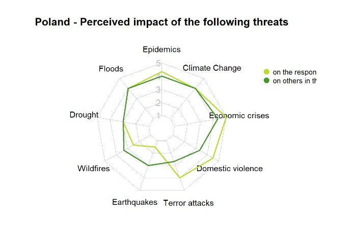
```
<br />

## Preparedness
```{r, out.width = "500px", echo = FALSE}
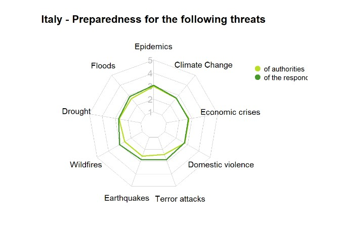
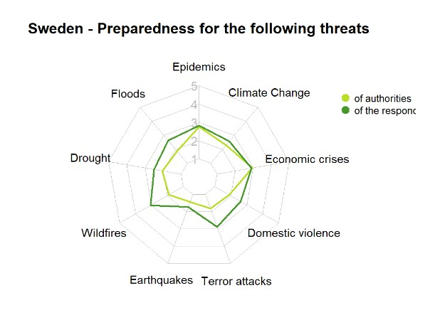
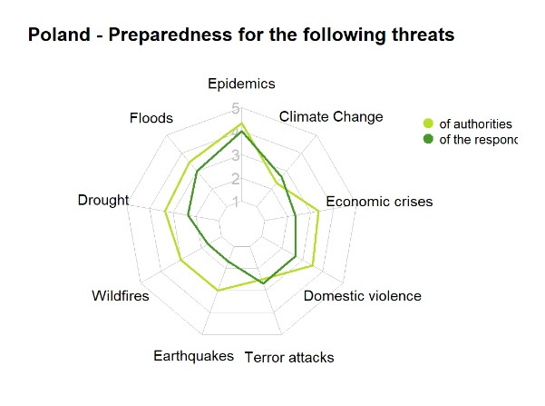
```
<br />

## Knowledge
```{r, out.width = "500px", echo = FALSE}
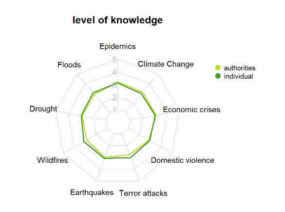
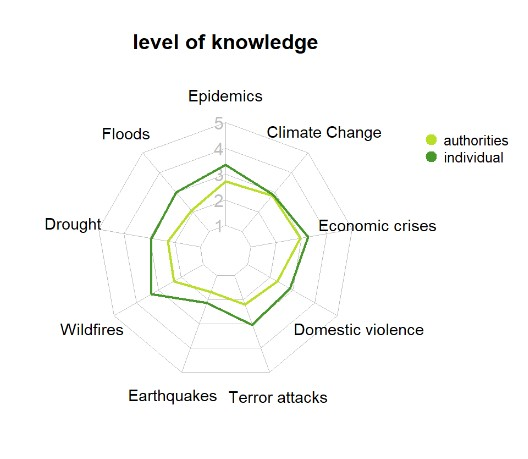
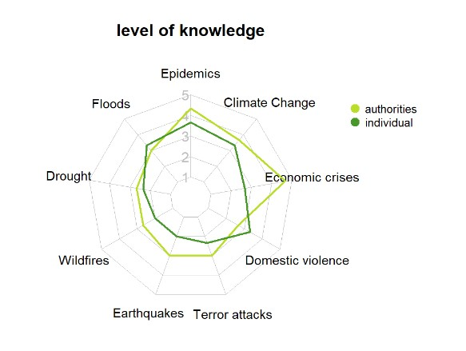
```

# Sources

Original study: https://www.nature.com/articles/s41597-020-00778-7?fbclid=IwAR1GqAQNW6oCa3gQLC9JEpVaJBAw8SBcc7fobxNX5ybJzwzZvirVxixXVlY